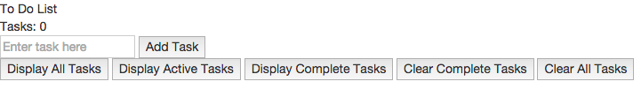
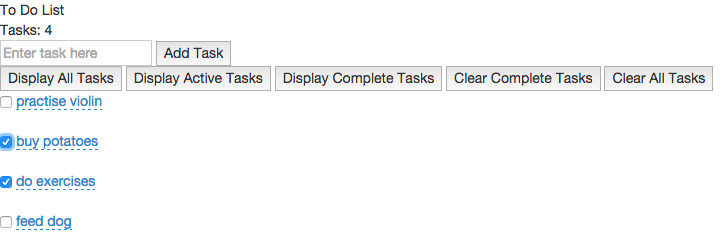

[](https://travis-ci.org/andygout/to_do_list)

To Do List
=================


Brief:
-------

Build a To Do List as a mini front-end SPA (Single Page Application).


User stories:
-------

```
As a forgetful person
I want to store my tasks
So that I don't forget them

As a person with limited time
I want to instantly be able to update my list (adding and changing entries)
So that I have more time to think about other things

As a person who actually gets stuff done
I want to mark my tasks as done
So that I don't do them twice

As a person with a lot of tasks
I want to be able to filter my tasks by "All", "Active", "Complete"
So that I only see the relevant tasks

As a person who doesn't like counting by hand
I want to see a total number of tasks
So that I don't have to count

As someone who has done lots of stuff
I want to be able to clear my completed tasks
So I never see them again
```


Technologies Used:
-------

- [AngularJS](https://docs.angularjs.org/guide/introduction) (In software development, AngularJS (commonly referred to as "Angular") is an open-source web application framework maintained by Google and by a community of individual developers and corporations to address many of the challenges encountered in developing single-page applications. It aims to simplify both the development and the testing of such applications by providing a framework for client-side model–view–controller (MVC) architecture, along with components commonly used in rich Internet applications)
- Tested using [Karma](http://karma-runner.github.io/0.13/index.html) (a JavaScript test-runner built with Node.js, and meant for unit testing)
- E2E (end-to-end) tested using [Protractor](http://angular.github.io/protractor) (end-to-end test framework for AngularJS applications; runs tests against your application running in a real browser, interacting with it as a user would; a Node.js programme) using a [Selenium Server](http://www.seleniumhq.org/) (automates browsers)
- [Angular-xeditable](http://vitalets.github.io/angular-xeditable/) (bundle of AngularJS directives that allows you to create editable elements; such technique is also known as click-to-edit or edit-in-place)


Site setup:
-------

#### [npm](https://docs.npmjs.com/cli/init) / [package.json](https://docs.nodejitsu.com/articles/getting-started/npm/what-is-the-file-package-json)

- Install Node (if not already): `$ brew install node`
- Create `package.json` with `$ npm init` (return for all); gives info to npm to identify project and handle its dependencies
- `node_modules` directory is created when first node package is installed, i.e.: `$ npm install jasmine-node --save-dev` (`--save-dev` switch adds node package directory in `node_modules` directory and lists it in `package.json` file as a development-only dependency; removing `-dev` would list simply as a dependency)
- Add `node_modules` folder to `.gitignore` file
- If pulling project from separate repo, run `$ npm install` from root (*a la* `bundle` for a Ruby project)
- Ensure okay and check for version number: `$ node -v`


#### [Bower](http://bower.io/)

- Package manager similar to npm but optimized for front-end; can be used in conjunction with Sinatra, Node or Rails to manage front-end dependencies
- Install bower (if not already): `$ npm install -g bower` (made global with `-g` switch)
- Ensure okay and check for version number: `$ bower -v`
- In project directory `$ npm install --save-dev bower`
- Create `bower.json` with `$ bower init` (return for all)
- `bower_components` directory is created when first package is installed, i.e.: `$ bower install jquery --save` (`--save` switch adds package directory in `bower_components` directory and lists it in `bower.json` file as a dependency; `--save-dev` would list it as a development-only dependency)
- Add `bower_components` folder to `.gitignore` file
- If pulling project from separate repo, run `$ bower install` from root (*a la* `bundle` for a Ruby project)


#### Packages

- `$ bower install jquery --save`
- `$ bower install bootstrap --save`
- `$ bower install angular --save`
- `$ bower install angular-resource --save`


#### [Angular-xeditable](http://vitalets.github.io/angular-xeditable/)

- `$ bower install angular-xeditable`

- Add to dependencies in `js/app.js`:

````js
var toDoList = angular.module('ToDoListApp', ['ngResource', 'xeditable']);
````

- `index.html` - reference in head:

````html
<link rel="stylesheet" href="bower_components/angular-xeditable/dist/css/xeditable.css">
<script src="bower_components/angular-xeditable/dist/js/xeditable.js"></script>
````

- `index.html` - define Angular app (if not already):

````html
<html ng-app="ToDoListApp">
````

- `index.html` - markup element that should be editable:

````html
<li>
  <input type="checkbox" ng-model="task.complete"/>
  <a href="#" editable-text="task.descr">{{ task.descr || "empty" }}</a>
</li>
````

- Add as dependency to `bower.json` file and include in `karma.conf.js` file


#### Run site (not on server)

- `$ open index.html`


Testing setup - Karma:
-------

#### Test environment

- `$ bower install angular-mocks --save-dev`
- `$ bower install angular-route --save-dev`


#### [Karma](http://karma-runner.github.io/0.13/index.html)

- `$ npm install karma --save-dev`
- `$ npm install karma-jasmine karma-chrome-launcher karma-phantomjs-launcher --save-dev`
- `$ npm install -g karma-cli`
- Create file: `test/karma.conf.js` with [contents](https://github.com/andygout/to_do_list/blob/master/test/karma.conf.js) as per this codebase


#### Run tests

- `$ karma start test/karma.conf.js`


Testing setup - Protractor:
-------

#### Test environment

- Install Node (if not already): `$ brew install node` and check it is > v0.10.0 using `$ node -v`
- Ensure [Java Development Kit (JDK)](http://www.oracle.com/technetwork/java/javase/downloads/index.html) is installed (required to run Selenium Server); check by running `java -version`.


#### [Protractor](http://angular.github.io/protractor)

- Install Protractor globally (if not already): `$ npm install -g protractor` and ensure installation with `$ protractor -v`
- Download binaries: `$ webdriver-manager update`
- Run server: `$ webdriver-manager start` (and view server status info at: [http://localhost:4444/wd/hub](http://localhost:4444/wd/hub)) (*must be running whilst running Protractor tests*)
- Add development dependencies within project: `$ npm install --save-dev protractor`
- Create server for app: `$ npm install --save http-server`; then `$ npm install http-server -g`
- Run server: `$ http-server`  (*must be running whilst running Protractor tests*)


#### Specifying browser for tests (will default to Google Chrome)

- `test/e2e/protractor.conf.js`
- To run on Firefox:

```js
exports.config = {
  seleniumAddress: 'http://localhost:4444/wd/hub',
  specs: ['toDoListFeature.js'],
  capabilities: {
    browserName: 'firefox'
  }
}
```

- To run on both Firefox and Chrome:
```js
exports.config = {
  seleniumAddress: 'http://localhost:4444/wd/hub',
  specs: ['toDoListFeature.js'],
  multiCapabilities: [{
    browserName: 'firefox'
  }, {
    browserName: 'chrome'
  }]
}
```


#### Run tests

- `$ webdriver-manager start`
- `$ http-server` *or* `$ node server.js` (Express server) *or* `$ ruby server.rb` / `$ rackup` (Sinatra server)
- `$ protractor test/e2e/protractor.conf.js`


Running site on [Express](http://expressjs.com/) server:
-------

- `$ npm install express --save`
- Save Express in the dependencies list in `package.json`: `"express": "^4.13.3"`
- Create `server.js` file in root directory with [contents](https://github.com/andygout/to_do_list/blob/master/server.js) as per this codebase
- Create new folder `public` in root and relocate `js`, `style` and `bower_components` directories into it (ensure `karma.conf.js` file amends routes for `bower_components` accordingly and create `.bowerrc` in root with following content: `{"directory" : "public/bower_components"}`)
- `test/e2e/toDoListFeature.js` will need to change port from 8080 to that required by Express: 3000
- `package.json` file: "scripts": "start" will now need `node server.js`
- NB: Running site without a server will no longer work once local server has been established
- Run server: `$ node server.js`
- View site at: [http://localhost:3000](http://localhost:3000)


Running site on [Sinatra](http://www.sinatrarb.com/) server:
-------

- Create `Gemfile` file in root directory:

````ruby
source 'https://rubygems.org'

gem 'sinatra'
````

- Install gem: `$ bundle`

- Create `server.rb` file in root directory:

````ruby
require 'sinatra'

get '/' do
  send_file 'index.html'
end

set :public_folder, 'public'
````

- Create `config.ru` file in root directory:

````ruby
require './server'

run Sinatra::Application
````

- `test/e2e/toDoListFeature.js` will need to change port from 8080 to that required by Sinatra: 9292 or 4567 (depending on which method below is used)
- Run server with Rackup: `$ rackup` (view site at: [http://localhost:9292](http://localhost:9292))
- Or Rackup via specific port (to be consistent with Sinatra default port): `$ rackup -p 4567` (view site at: [http://localhost:4567](http://localhost:4567))
- Or with Sinatra `$ ruby server.rb` (view site at: [http://localhost:4567](http://localhost:4567))


Deploying to [Heroku](https://devcenter.heroku.com/articles/git)
-------

- `$ heroku create`
- Ensure `bower_components` is removed from `.gitignore` file
- `$ git push heroku master`


Next steps:
-------

- Protractor test for editable text
- Protractor tests: How to specify task from list with which to interact (current Protractor warning: 'WARNING - more than one element found for locator by.model("task.complete") - the first result will be used')
- Karma tests: Check that clicking complete checkbox sets task.complete value to true
- Delete button for each (and functionality; will need to target specific task)
- Individual counts for 'All', 'Active' and 'Complete'
- Reverse list order functionality
- Index: Correct way to disable filter for displayAllTasksButton (currently: ng-click="filterCriteria = none")
- Figure out how to use console.log() or debugger effectively with Protractor
- Create a persistance layer (e.g. MongoDB), or use LocalStorage or the filesystem through Node
- Make it look purdy (CSS) - try a framework like Bootstrap or Foundation
- Possible to run Travis CI tests using Chrome rather than Firefox?
- Rebuild in DogeScript

Links:
-------

[Github - Makers Academy: To Do Challenge](https://github.com/makersacademy/todo_challenge)

[Github - Makers Academy: Week 7 - Further Javascript](https://github.com/makersacademy/course/blob/master/further_javascript/github_profiles.md)

[Github - Makers Academy: GitHub profiles (AngularJS 1.3 Introduction)](https://github.com/makersacademy/course/blob/master/further_javascript/angularjs.md)

[Github - Makers Academy: Protractor for GitHub Profiles](https://github.com/makersacademy/course/blob/master/further_javascript/protractor.md)

[Angular-xeditable](http://vitalets.github.io/angular-xeditable/)


Images:
-------

#### Empty list


#### All tasks


#### Editable text


#### Active tasks filter applied


#### Complete tasks filter applied
